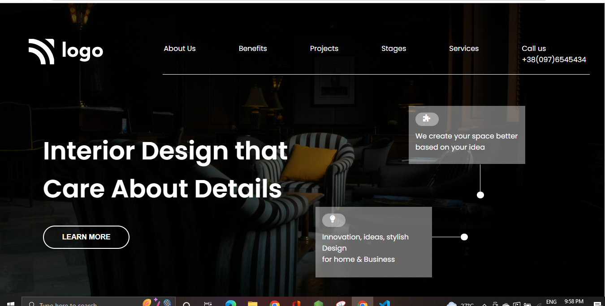

## Hashnode link- [Markdown guide](https://img.shields.io/badge/project-developer%20landingpage-green)

# Developer landing page.
 In This Interior landing page project I used HTML and CSS. I learn more about Position relative and others properties of CSS. Thanks to the Ineuronai for Teaching us in depth. 
## Netlify
[Live](https://interior-landingpage.netlify.app/)
# Learn from the project.
* Ids and classes.
* Designing buttons.
* Position-relative.
* css colors.

# Screenshot of project.

## Thanks to-

